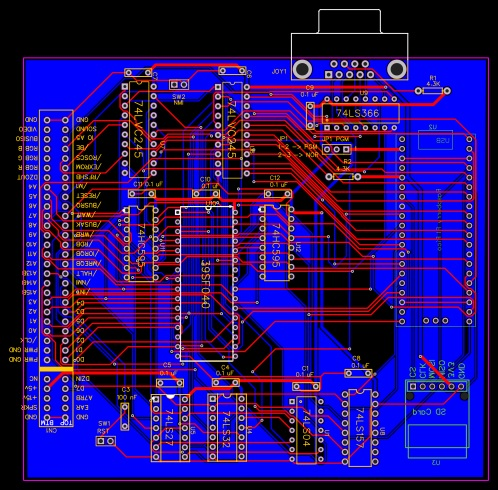
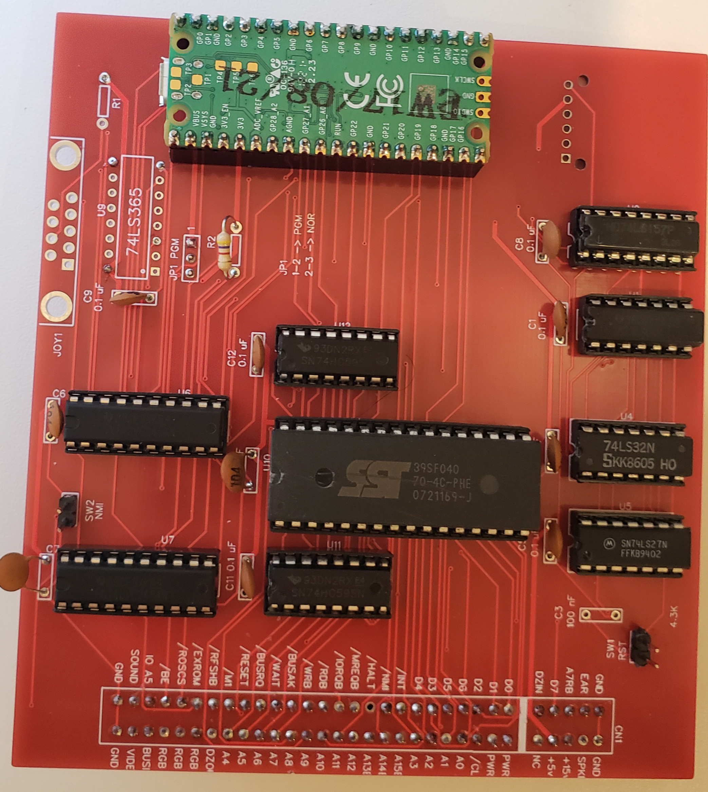

## Fotos y esquemático ##

Aquí se irán agregando sucesivas versiones de la interface TS Pico, junto con los archivos necesarios para ser utilizados con EasyEDA o cualquier otra herramienta de desarrollo que se utilice

- Version 0.1 -> Versión original. También se dejan los archivos de fabriacación Gerber, y los .JSON del esquemáticos y la placa para ser importados en EasyEDA

 </img>
Vista de la placa

 </img>
Foto de frente

 </img>
Foto de atrás

