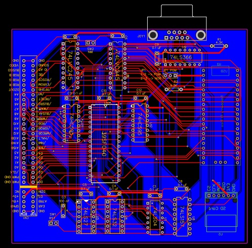
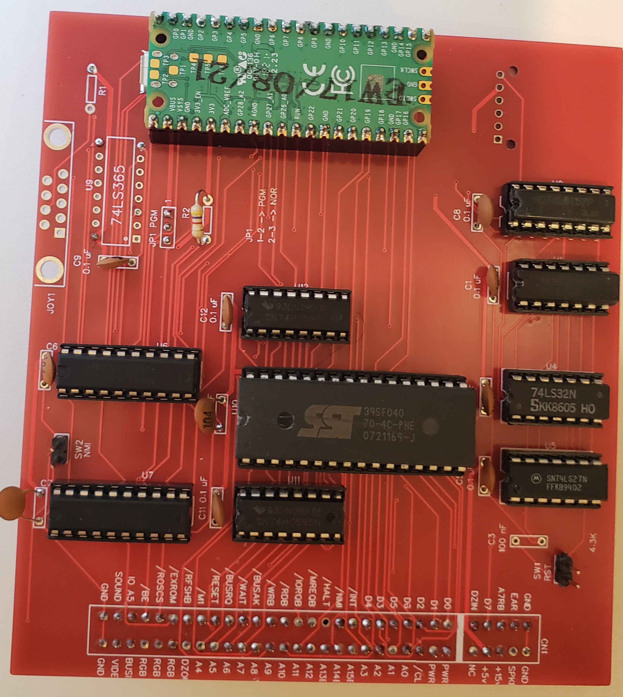
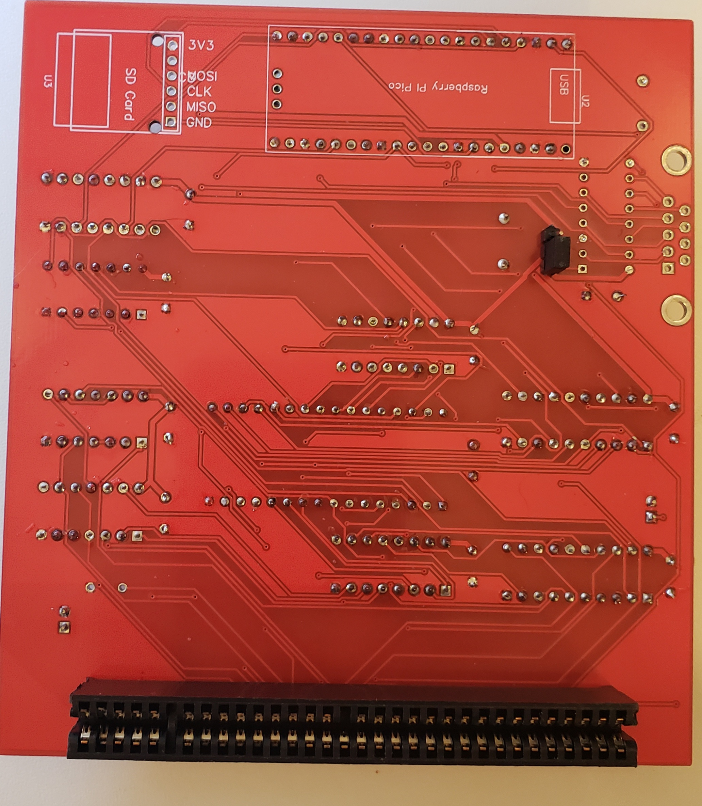

## Photos and schematics ##

Succesive versions of TS Pico interface will be kept here, with several files to be used with EasyEDA or any other electronic development tool

- Version 0.1 -> Original version. Also Gerber manufacturing file, and schematics and board .JSON to be imported on EasyEDA

 </img>
Board view

 </img>
Front picture

 </img>
Back picture

